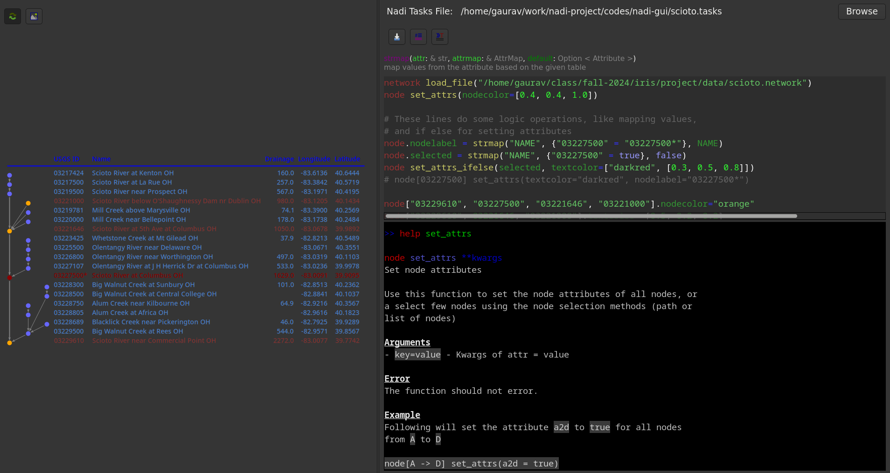

# Nadi System GUI
This is a GUI to run Tasks and create graphical outputs.

Currently it can run any task and show a graphical representation of
the network. Although it is a GUI, only the graph part takes advantage
of the GUI part and the tasks still has to be run through text.

# Screenshot

Here the left pane has table output, while right top shows a tasks
file and right bottom has a terminal. The tasks in the file can be run
in the terminal (auto runs the whole file on open/save). Anytime any
task is run, the graph is updated.

The graphics can be exported to PDF/SVG/PNG format.
